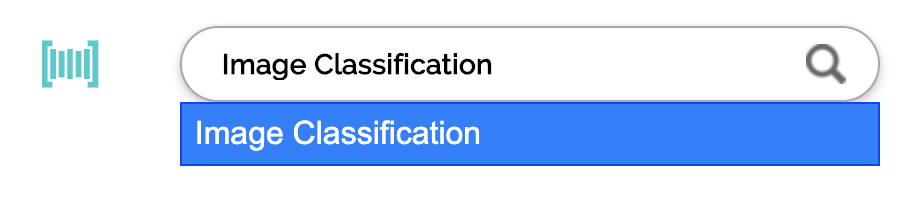
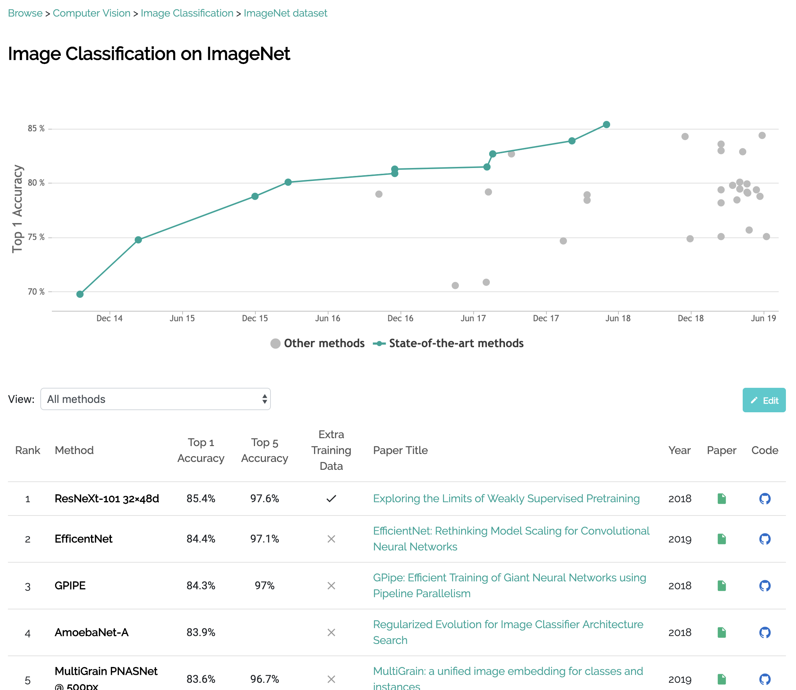

# Getting in Started

## What You Will Learn

In this tutorial, you will submit your first machine learning model implementation to the Sotabench resource. You will:

- 🔎 **Find** an implementation of a modern image classification model
- 📊 **Configure** a `benchmark.py` file to evaluate the model
- 🎉 **Submit** the repository to sotabench and obtain *state-of-the-art* results!

Sound fun? Let's get started!

## Find an Image Classification Model

To find model implementations, we use [Papers With Code](), which has over 10,000 implementations and also ranks them
according to their performance on popular research benchmarks.

Search for **Image Classification**:

This will bring you to the **Task Page**, where you can see various different *benchmarks* for
evaluating the performance of models on image classification:

Let's click on **ImageNet** since this is now the most famous image classification benchmark:

This is the **Evaluation Page**. From the graph, we can see the historical progress on the task, and how models have got
better over time. Below we can see the leaderboard of the best methods, ranked by performance.

Let's click on the top paper **Exploring the Limits of Weakly Supervised Pretraining**. This brings us to the paper
page where we can see publicly available implementations:

There is an implementation in PyTorch, which we can evaluate using sotabench. Head to the repository:

* `mkdocs new [dir-name]` - Create a new project.
* `mkdocs serve` - Start the live-reloading docs server.
* `mkdocs build` - Build the documentation site.
* `mkdocs help` - Print this help message.

## Project layout

    mkdocs.yml    # The configuration file.
    docs/
        index.md  # The documentation homepage.
        ...       # Other markdown pages, images and other files.
